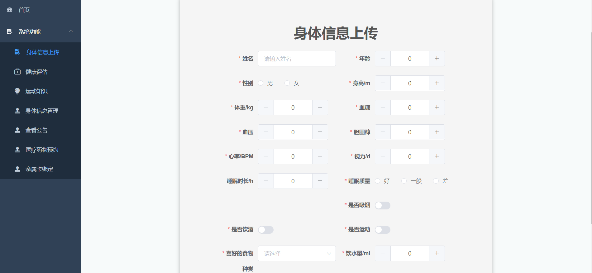
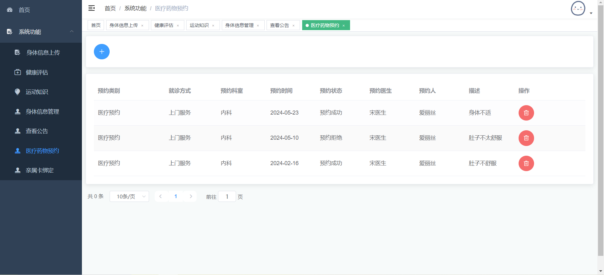

# 社区老人健康信息管理系统 

##（源代码+12000字文档+ppt）

## 项目简介
社区老人健康信息管理系统是一套基于SpringBoot的前后端分离的管理系统，分为管理员、社区医生、老人三个角色。 
管理员可以对用户、角色等权限进行管理，并且可以发布通知公告，也可以查看老人的身体健康信息。 
社区医生可以对老人的预约申请进行通过或拒绝处理，并且可以查看每个老人每天的身体信息以及健康评估信息，并且可以更新运动知识相关，方便老人选择适合自己的运动。 
老人可以上传自己的每日身体信息包括血糖脉搏等信息，系统根据老人上传的身体信息可以根据算法进行评估，老人可以查看自己的身体健康评估信息。同时还可以向社区医生进行药物或医疗预约，还可以绑定亲属卡，后续老人不方便预约，子女可以用自己的账号替老人预约等。 
前端使用Vue框架，后端使用SpringBoot框架，数据库使用的是Mysql。 
本系统功能完善，涉及的技术比较广，难度适中，都是市面上主流的技术，非常适合作为设计项目或开发学习。 
视频介绍：<a href="https://www.bilibili.com/video/BV1Yw4m1D7oy/?spm_id_from=333.999.0.0" target="_blank">点击查看B站视频介绍</a>

## 功能介绍

## 技术学习

如果你在安装过程中，或对项目有疑问，可以关注本人公众号获取本人联系方式进行咨询。 
公众号内还有更多项目供你选择。 

## 技术服务

## 技术栈

| 工具及技术             | 版本    |
| ---------------------- | ------- |
| idea                   |         |
| JDK                    | 1.8     |
| SpringBoot             | 2.2.1   |
| MyBatis                | 1.3.2   |
| JWT                    | 3.4     |
| Vue                    | 2.0     |
| ElementUI              | 2.0     |
| MySQL                  | 5.7     |
| Node                   | v16.16.0|

## 系统图片

#### 1.登录页
 
#### 2.用户首页
 
#### 3.身体信息上传
 
#### 4.健康评估
 
#### 5.运动知识
 
#### 6.医疗药物预约
 
#### 7.亲属卡绑定
 
#### 8.查看公告
 
#### 9.老人详细身体信息查看
 
